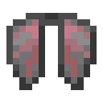

# Advanced Autopilot

> Advanced, automatic elytra flight.

This mod provides an advanced autopilot system for elytra flight. The autopilot knows how to ascend, glide, and land; it can also travel towards a goal, swap out elytra with low durability, and show flight information in a HUD. The mod is highly configurable, but has sensible defaults for getting started. If you want a simpler autopilot, I recommend TheMegax's [Elytra Autopilot](https://github.com/TheMegax/fabric-elytra-autopilot) mod, which was the inspiration for this mod.

## Features

A few of the mod's (configurable) features:
- **Elytra swap**: Swap out elytra when durability is low
- **Emergency landing**: Perform emergency landing when elytra durability is low
- **Flight resumption**: Try to resume flight towards goal after error [experimental]
- **Goals**: Fly towards a goal that is set by the player
- **HUD**: Show flight information in a HUD (heads-up display)
- **Powered flight**: Use rockets while gliding to increase speed
- **Risky landing**: Dive straight down, then correct at the last moment
- **Rocket refill**: Refill rockets from inventory into main hand
- **Unloaded chunk handling**: Fly through unloaded chunks (for a limited time) before landing

## Usage

- To engage or disengage the autopilot, press the toggle key (default <kbd>R</kbd>) while flying
  - If a [goal](#goals) is set, the autopilot will fly towards the goal
  - Otherwise, the autopilot will maintain its current direction (yaw) indefinitely
  - The autopilot's behaviour can be tweaked by adjusting the [configuration](#configuration)
- To trigger an automatic landing, use the `/land` command while flying
- The autopilot is intelligent and will adapt its [behaviour](#behaviour) during flight
    - However, it does not monitor the blocks around you; see [limitations](#limitations)

### Goals

- To set a goal, use the `/setgoal X Z` command while flying (with or without the autopilot engaged)
- To clear the current goal, use the `/cleargoal` command, stop flying, or disengage the autopilot

### Behaviour

The pseudocode below describes the rough behaviour of the autopilot:

```
if a goal is set and we are close to the goal:
    land
else if we are flying through an unloaded chunk:
    land
else if we are high enough to start gliding:
    glide
else if we are holding fireworks:
    ascend
else:
    land
```

### Configuration

- The mod features extensive configuration for (almost) anything that you'd want to change
- To access the configuration page, open the [ModMenu](https://www.curseforge.com/minecraft/mc-mods/modmenu)
  - Alternatively, you can manually edit the `advancedautopilot/config.json` file in your mod config directory
- In the configuration, _height_ refers to the vertical distance from the player to the ground, _not_ the Y coordinate

### Limitations

- The autopilot does not monitor your surroundings (except your height)
    - When ascending, it will happily crash you into a ceiling
    - When gliding, it will happily crash you into a wall
    - When landing, it will happily drop you into lava
    - Due to this limitation, for the safest long-distance flight, I recommend flying above the nether roof

## Requirements

- Minecraft 1.18.1
- [Fabric Loader](https://fabricmc.net/use/installer)
- [Fabric API](https://www.curseforge.com/minecraft/mc-mods/fabric-api)
- [Cloth Config API](https://www.curseforge.com/minecraft/mc-mods/cloth-config)
- [ModMenu](https://www.curseforge.com/minecraft/mc-mods/modmenu)

## Credits

- This project was bootstrapped from the [Fabric Example Mod](https://github.com/FabricMC/fabric-example-mod) template
- This project is based on TheMegax's [Elytra AutoPilot](https://github.com/TheMegax/fabric-elytra-autopilot), which was forked from Simon Lourson's [Elytra Auto Flight](https://github.com/simonlourson/fabric-elytra-auto-flight)

## License

This project is available under the MIT license.
